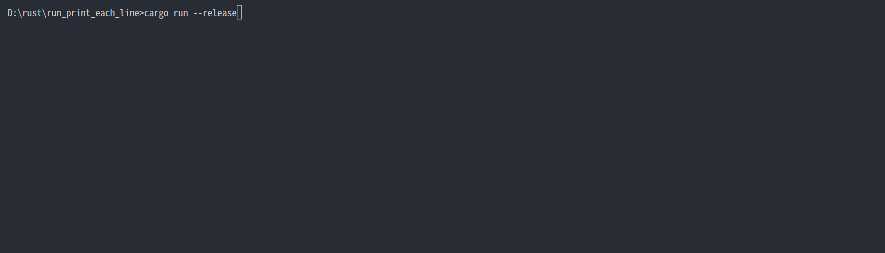

# print_each_line
It prints each line and execution time during execution. It can be used as a super simple profiler.

## Example

```rust
use print_each_line::printline;
use dpss::dp;
use std::thread::sleep;
use std::time::{Duration};

#[printline]
fn main() {
    
    let arr = vec![-2445617,1415464,-1234475,-8719641,4811893];
    let result = dp::find_subset(arr, -3907748, 100);
    sleep(Duration::from_millis(1234));
    let route1: Vec<i32> = vec![-8719641, 4811893];
    let answer: Vec<Vec<i32>> = vec![route1];
    assert_eq!(result, answer);

}
```

Output 
```
Ran ... 📄 let arr = vec ! [- 2445617, 1415464, - 1234475, - 8719641, 4811893]  📄 ... ⌛ (Elapsed 0 milliseconds) ⌛
Ran ... 📄 let result = dp :: find_subset (arr, - 3907748, 100)  📄 ... ⌛ (Elapsed 325 milliseconds) ⌛
Ran ... 📄 sleep (Duration :: from_millis(1234))  📄 ... ⌛ (Elapsed 1236 milliseconds) ⌛
Ran ... 📄 let route1 : Vec < i32 > = vec ! [- 8719641, 4811893]  📄 ... ⌛ (Elapsed 0 milliseconds) ⌛
Ran ... 📄 let answer : Vec < Vec < i32 >> = vec ! [route1]  📄 ... ⌛ (Elapsed 0 milliseconds) ⌛
Ran ... 📄 assert_eq ! (result, answer)  📄 ... ⌛ (Elapsed 0 milliseconds) ⌛
```

